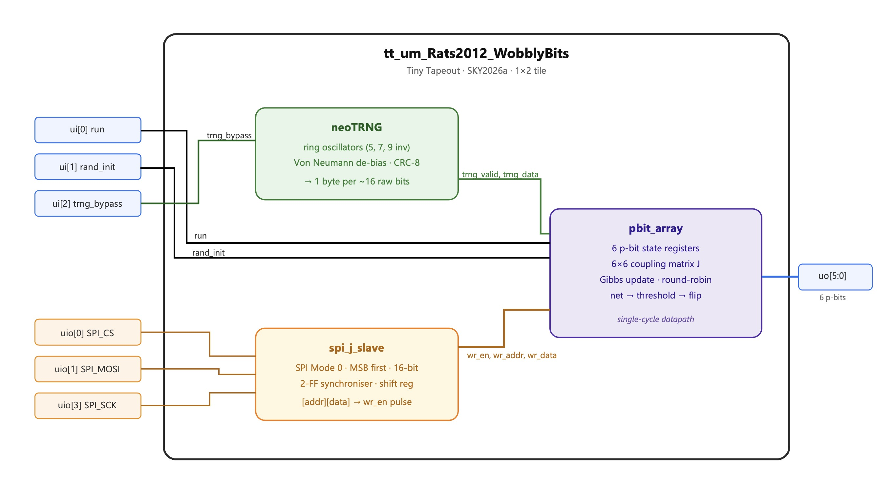
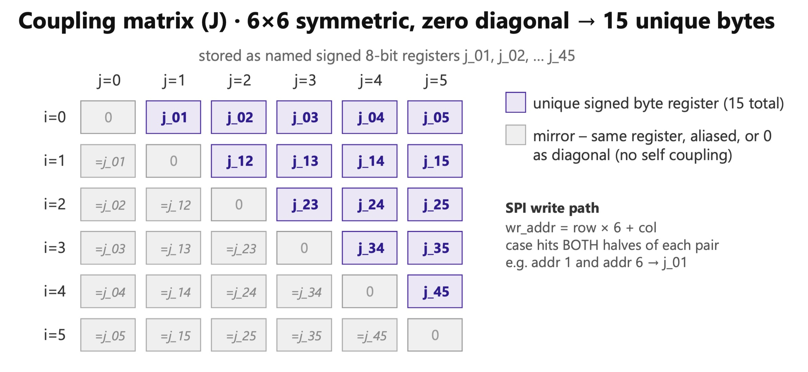

## How it works

WobblyBits is a probabilistic computing chip. It contains **6 p-bits** (probabilistic bits) that fluctuate randomly between 0 and 1 with a probability controlled by their neighbours.

Together the six p-bits form a small Ising/Boltzmann machine: load a coupling matrix over SPI, release the `run` pin, and the network samples from the encoded probability distribution.

### Architecture

#### True random number generator

Hardware entropy is provided by the [neoTRNG](https://github.com/stnolting/neoTRNG) core using three inverter rings (5/7/9 stages XOR-combined).

Each TRNG byte updates one p-bit in round-robin order.

The update rule is a hardware approximation of the sigmoid:

$$
\text{net}*i = \sum*{j \ne i} J[i][j],(2s_j - 1)
$$

$$
\text{thresh} = \operatorname{clamp}(128 + \text{net}_i,; 0,; 255)
$$

$$
s_i^{\text{new}} =
\begin{cases}
1 & \text{if } \text{trng_byte} < \text{thresh} \
0 & \text{otherwise}
\end{cases}
$$

`thresh` maps the net field linearly into a probability: `net=0` gives 50/50 probability. Positive values bias toward 1; negative toward 0.

The linear approximation saturates at $ |net| > 127 $.

#### Coupling matrix

The 6×6 coupling matrix has 15 unique off-diagonal entries (the matrix is symmetric; diagonal is 0). These are stored as 8-bit signed registers and accessible via SPI using row-major addressing (`addr = 6·row + col`).

{width=60%}

Writing either `J[i][j]` or `J[j][i]` updates the same physical register.

Only one register is stored per pair (i,j), reducing storage from 36 to 15 parameters, as otherwise we were struggling to fit on 2 tiles.

**Reset default:** ferromagnetic K=20 (`J[i][j] = 20` for all i≠j). This puts the network near the critical temperature of the all-to-all 6-spin model, giving solid correlated fluctuations out-of-the-box without any SPI configuration.

#### SPI interface

SPI Mode 0 (CPOL=0, CPHA=0), MSB first. Each transaction is 16 bits: an address byte (`addr[5:0]` = register 0–35) followed by a data byte (8-bit signed weight).

If CS is deasserted mid-frame the partial transaction is silently discarded. The SPI inputs are double-FF synchronised into the 25 MHz system clock domain, limiting SCK to ≈12 MHz (the RP2040 demo board uses ≤4 MHz).

### Control pins

| Pin | Function |
|-----|----------|
| `ui[0]` run | 1 = network running, 0 = paused (p-bit updates frozen) |
| `ui[1]` rand_init | 1 = seed p-bit states from TRNG on rising edge of `run` |
| `ui[2]` trng_bypass | 1 = freeze TRNG and p-bit updates (deterministic simulation) |

### Sampling behaviour

The network approximates Boltzmann sampling:

$$
P(s) \propto \exp(-E(s)/T)
$$

with energy

$$
E = -\sum_{i<j} J_{ij}s_is_j
$$

Low-energy states appear most frequently during long observation windows.

## How to test
### Bring up steps

1. Power on with `ui[0]` (run) = 0
2. Load coupling weights via SPI (send `[addr, weight]` byte pairs for each `J[i][j]` entry you want to set)
3. Deassert SPI CS, then assert `ui[0]` = 1 to start the network
4. Sample `uo_out[5:0]` (the p bit states) repeatedly.

### No-config smoke test

Without any SPI write, the chip resets to ferromagnetic K=20. Assert `run` and observe `uo_out[5:0]`.

I expect you should see correlated random fluctuations - all six bits tend to be in the same state (0 or 1) but occasionally flip together. This confirms TRNG → p-bit datapath is working.

### TRNG quality check

Set J=0 for all entries (fully uncoupled) via SPI. Each p-bit now should fluctuate independently at 50/50.

### TRNG bypass (deterministic simulation)

Assert `ui[2]` = 1 to freeze all updates. Output holds its last value indefinitely. Release to resume.

### Ising ground-state test (ferromagnetic)

With default K=20, after sufficient warm-up (a few thousand clock cycles) the network should spend noticeably more time in the all-0 or all-1 states than in mixed states - these are the ferromagnetic ground states.

For stronger alignment: load K=40 via SPI (addr pairs for all 30 off-diagonal positions). With K=40 the all-aligned probability is greater.

### MAX-CUT demo

Load a K₃,₃ graph (anti-ferromagnetic coupling J=−40 for cross-partition edges 0↔3, 0↔4, 0↔5, 1↔3, 1↔4, 1↔5, 2↔3, 2↔4, 2↔5; J=0 for intra-partition pairs).

The two MAX-CUT ground states are `000111` (pbit0–2 low, pbit3–5 high) and `111000`. After warm-up, whichever ground state basin the chain entered will dominate the sample histogram.

These were the RTL results for MAX-CUT K₃,₃ (1000 samples, `rand_init=0`):

| State  | Count | Frac  | Cut |
|--------|-------|-------|-----|
| 111000 | 445   | 44.5% | 9 ← **OPTIMAL** |
| 101100 | 142   | 14.2% | 5   |
| 101000 | 89    | 8.9%  | 6   |
| 111100 | 73    | 7.3%  | 6   |
| others | 251   | 25.1% | ≤5  |

Ground-state (cut=9) fraction: **44.5%** vs random baseline 3.1%. Only one ground state observed per run due to symmetry breaking — use `rand_init=1` to explore both basins.

## Notes

The TRNG uses ring oscillator structures that are experimental and have not been tested in hardware. Timing behaviour is not guaranteed.